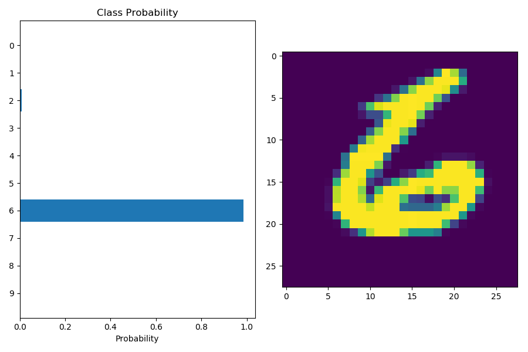
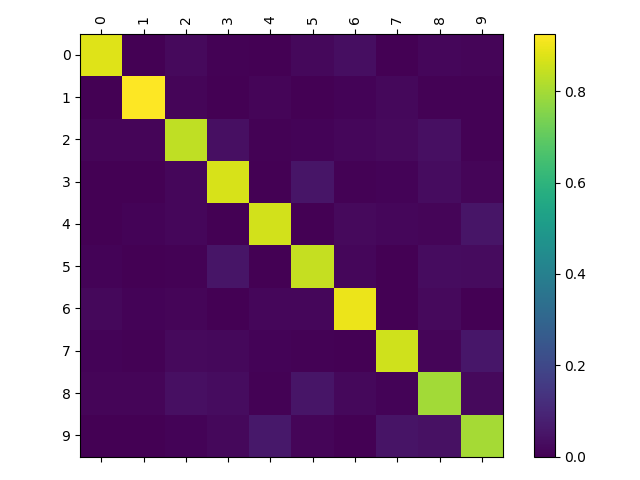
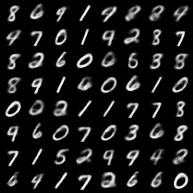
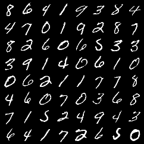
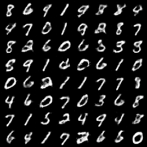
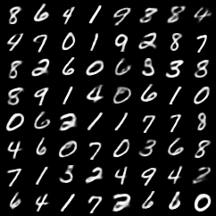
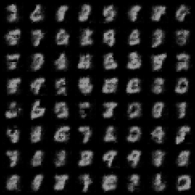
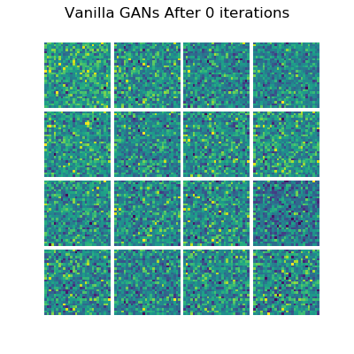
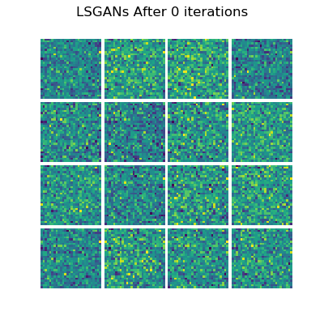

# Computer-Vision

A collection of CV implementations using Pytorch and OpenCV. Will continue to upload more 

## Image Classification (MNIST)

## Autoencoder Generated Images Vs Ground Truth Images (Vanilla_Autoencoder)

## Autoencoder Generated Images Vs Ground Truth Images (CNN_Autoencoder)

After being fed through an autoencoder, we can see that the reconstructed images are blurrier than the original images. Image quality seems a little better compared to the linear autoencoder.

## Variational Autoencoder Generated Images Vs Ground Truth Images (Vanilla VAE)

## Variational Autoencoder Generated Images Vs Ground Truth Images (CNN VAE)

VAE with a CNN. Unlike the vanilla VAE above, the bottleneck is rather small (Batch_size * 2 * 2). The resulting images clearly show the model struggling to generated a clear image due to the bottleneck. 

## Vanilla GANs (Linear Layers)

GANs training over time on MNIST data

## LSGANs (Linear Layers)

Same network architecture as Vanilla GANs but with Least Square loss

