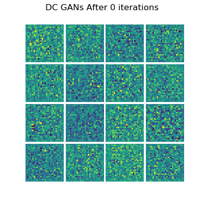
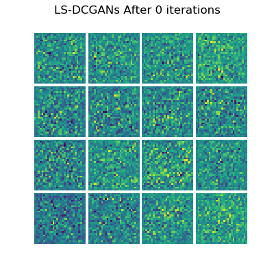
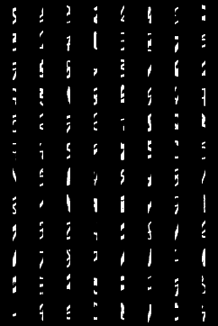
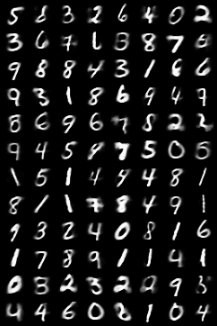
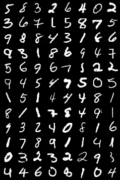

# Computer-Vision

A collection of CV implementations using Pytorch and OpenCV. Will continue to upload more 

## Image Classification (MNIST)

## Autoencoder Generated Images Vs Ground Truth Images (Vanilla_Autoencoder)

## Autoencoder Generated Images Vs Ground Truth Images (CNN_Autoencoder)

After being fed through an autoencoder, we can see that the reconstructed images are blurrier than the original images. Image quality seems a little better compared to the linear autoencoder.

## Variational Autoencoder Generated Images Vs Ground Truth Images (Vanilla VAE)

## Variational Autoencoder Generated Images Vs Ground Truth Images (CNN VAE)

VAE with a CNN. Unlike the vanilla VAE above, the bottleneck is rather small (Batch_size * 2 * 2). The resulting images clearly show the model struggling to generated a clear image due to the bottleneck. 

## Vanilla GANs (Linear Layers)

GANs training over time on MNIST data

## LSGANs (Linear Layers)

Same network architecture as Vanilla GANs but with Least Square loss

## DCGANs

Same cost function as Vanilla GANs but with Deep convolutional layers. Produces better clearer images compared to the Vanilla GANs

## DCGANs with LS Loss

Same architecture as DCGANs but with LeastSquares loss 

## CGAN

[CGAN](https://arxiv.org/abs/1411.1784) with a LS loss

## InfoGAN 

[Paper](https://arxiv.org/abs/1606.03657)

## CVAE 

For this reconstruction task, MNIST images were cropped to only keep the middle 4 columns of pixel values, and CVAE model was told to reconstruct the original image using the cropped images as inputs. 

Cropped Images / Reconstructed Images / Original Images

  

## AE-GAN 

[Paper](https://arxiv.org/pdf/1511.05644.pdf)

Adversarial Autoencoder that combines AE and GANs. This Pytorch implementation uses VAE instead of a vanilla AE. 

## WGAN

[Paper](https://arxiv.org/pdf/1701.07875.pdf)

## WGAN-GP

[Paper](https://arxiv.org/pdf/1704.00028.pdf)

## RecycleGan

[Paper](https://arxiv.org/pdf/1808.05174.pdf)

